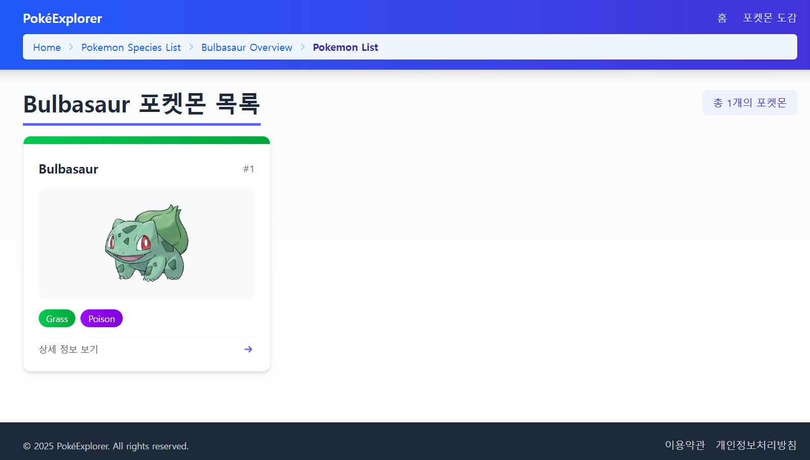

# TRIDGE HOME-TEST(사전과제) FE

PokéExplorer - 포켓몬 탐험 애플리케이션

## 프로젝트 개요

 
이 프로젝트는 포켓몬 API를 활용하여 포켓몬 데이터를 탐색할 수 있는 웹 애플리케이션으로, 특히 Breadcrumb(경로 탐색) 컴포넌트의 구현에 중점을 두었습니다.
사용자가 웹사이트 내에서 현재 위치를 쉽게 파악하고 이전 경로로 이동할 수 있도록 직관적인 네비게이션을 제공합니다. 세련된 UI 디자인과 사용자 경험을 통해 포켓몬 데이터를 효과적으로 탐색할 수 있습니다.

## 기술 스택

- React + TypeScript + Vite
- React Router DOM (라우팅)
- TanStack Query (데이터 페칭 및 캐싱)
- TailwindCSS (스타일링)

## 프로젝트 구조

```
src/
├── pages/           # 페이지 컴포넌트
│   ├── Home.tsx             # 홈 페이지
│   ├── SpeciesList.tsx      # 포켓몬 종류 목록
│   ├── SpeciesOverview.tsx  # 포켓몬 종류 상세 정보
│   ├── PokemonList.tsx      # 포켓몬 목록
│   └── PokemonDetail.tsx    # 포켓몬 상세 정보
├── shared/          # 공유 리소스
│   ├── hooks/       # 커스텀 훅
│   │   └── useBreadcrumb.ts  # 브레드크럼 관련 훅
│   ├── ui/          # UI 컴포넌트
│   │   ├── layout.tsx       # 레이아웃 컴포넌트
│   │   └── breadcrumb.tsx   # 브레드크럼 컴포넌트
│   ├── lib/         # 라이브러리 관련 코드
│   │   └── tanstack/      # TanStack Query 관련 유틸리티
│   ├── types/       # TypeScript 타입 정의
│   └── util/        # 유틸리티 함수
│       └── color.ts        # 색상 관련 유틸리티
└── App.tsx          # 애플리케이션 진입점 및 라우팅 설정
```

## 주요 기능 및 디자인 특징

### 1. 현대적인 UI 디자인

- **일관된 디자인 언어**: 모든 페이지에 동일한 디자인 요소 적용
- **타입별 그래디언트**: 포켓몬 타입에 따른 고유한 그래디언트 배경 사용
- **반응형 레이아웃**: 모바일부터 데스크톱까지 다양한 화면 크기에 적응
- **호버 효과**: 카드 요소에 마우스 호버 시 자연스러운 애니메이션 효과

### 2. Breadcrumb 네비게이션

- **동적 경로 처리**: URL 파라미터에 따라 실제 포켓몬 이름을 표시
- **사용자 경험 최적화**: 현재 위치 강조 및 이전 경로로 쉽게 이동
- **모바일 대응**: 작은 화면에서도 가독성 유지

### 3. 데이터 관리 및 코드 구조

- **모듈화된 아키텍처**: 관심사에 따라 분리된 폴더 구조 (`lib`, `types`, `util` 등)
- **중앙 집중식 타입 정의**: `types` 폴더에 모든 인터페이스 정의
- **재사용 가능한 API 유틸리티**: 중앙집중식 API 함수로 코드 중복 방지
- **TanStack Query 최적화**: 일관된 쿼리 옵션과 캐싱 전략

### 4. 포켓몬 상세 표시

- **종류 정보**: 포켓몬 종류에 대한 상세 정보 표시 (색상, 서식, 설명 등)
- **포켓몬 정보**: 개별 포켓몬의 능력치, 타입, 스탯 등 상세 정보 표시
- **시각화**: 포켓몬 타입에 따른 그래프 및 시각적 표현 강화

## 주요 기능

1. **포켓몬 종류 탐색**: 다양한 포켓몬 종류에 대한 정보 탐색
2. **포켓몬 상세 정보**: 각 포켓몬의 능력치, 타입, 스탯 등 상세 정보 제공
3. **직관적인 네비게이션**: Breadcrumb를 통한 웹사이트 내 위치 파악 및 이동
4. **시각적 표현**: 포켓몬 타입에 따른 그래디언트 및 시각적 표현

## 구현 과정에서 중점을 둔 부분

- **사용자 경험**: 세련된 UI와 직관적인 네비게이션을 통한 우수한 UX 구현
- **타입 안전성**: TypeScript 인터페이스를 활용한 코드 품질 향상
- **반응형 디자인**: 다양한 화면 크기에 적응하는 레이아웃
- **성능 최적화**: TanStack Query를 활용한 데이터 캐싱 및 관리
- **일관된 디자인**: 전체 애플리케이션에 일관된 디자인 요소 적용

## 실행 방법

```bash
# 의존성 설치
npm install
# 또는
yarn install

# 개발 서버 실행
npm run dev
# 또는
yarn dev
```

## 라우트 구조

- `/` - Home
- `/species` - Home > Pokemon Species List
- `/species/:species` - Home > Pokemon Species List > {{pokemonSpeciesName}} Overview
- `/species/:species/pokemons` - Home > Pokemon Species List > {{pokemonSpeciesName}} Overview > Pokemon List
- `/species/:species/pokemons/:pokemon` - Home > Pokemon Species List > {{pokemonSpeciesName}} Overview > Pokemon List > {{pokemonName}}
